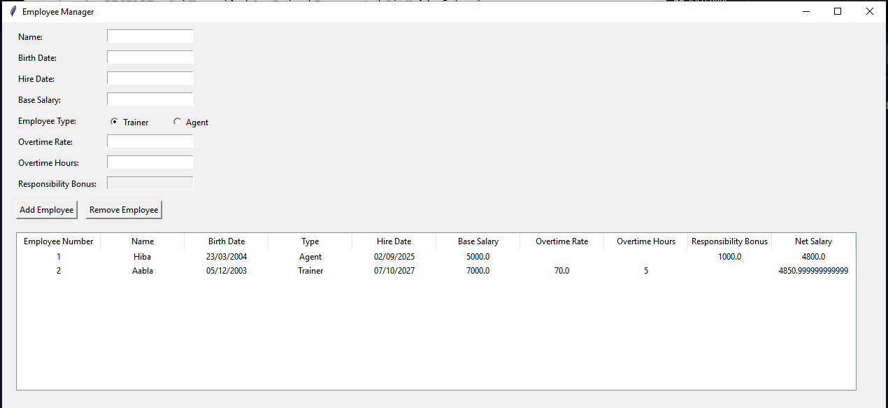

## Description
An employee tracking system with a Tkinter-based graphical user interface. This Python program enables users to manage employee information, including addition, and removal of records. Employee data is stored in a JSON file, and net salaries are calculated based on different employee types.
## Screenshot

